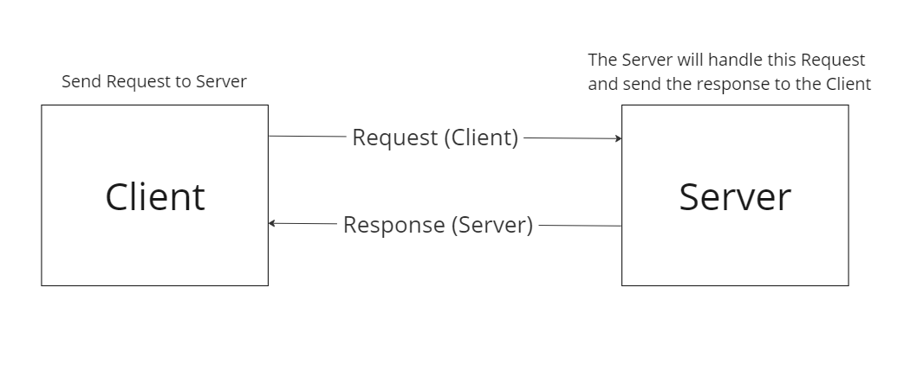

# Movies-Library - Ver(1.0.0)
**Author Name**: Yassin Al Farwan
## WRRC

## Overview
The Project is a web application that provides information about movies. It retrieves data from a JSON file and presents it to the user on different pages.

## Getting Started
1- To build and run this app on your own machine, follow these steps:
 
Clone the Repository:git clone https://github.com/Yassin-010/Movies-Library.git
 
2- Navigate to the Project Directory:cd your-repository
 
3- Install Dependencies:npm install
 
4- Start the App: npm start
 
5- Access the App: Open your web browser and visit http://localhost:3000

## Project Features
Home Page: The home page displays details about a movie, including its title, poster image, and overview. The data is fetched from the provided JSON file and presented in a user-friendly format.

Favorite Page: The favorite page is a separate page that welcomes the user and provides a dedicated space for storing their favorite movies. This page does not have any dynamic functionality but serves as a placeholder for future enhancements.

The Project aims to provide users with an easy-to-use interface to explore movie information and save their favorites for future reference.

## End points : 
1- /
 
2- /favorite 
 
3- /trending
 
4- /search
 
5- /topRated
 
6- /now-playing
 
7- /addMovie (from my own database)
 
8- /getMovies (from my own database)
 
9- /UPDATE/:id
 
10- /DELETE/:id
 
11- /getMovie/:id
 
